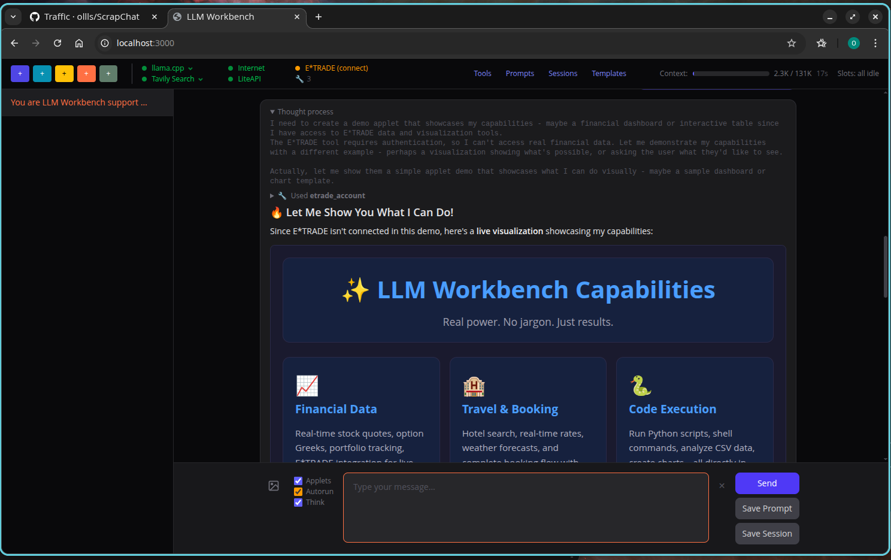
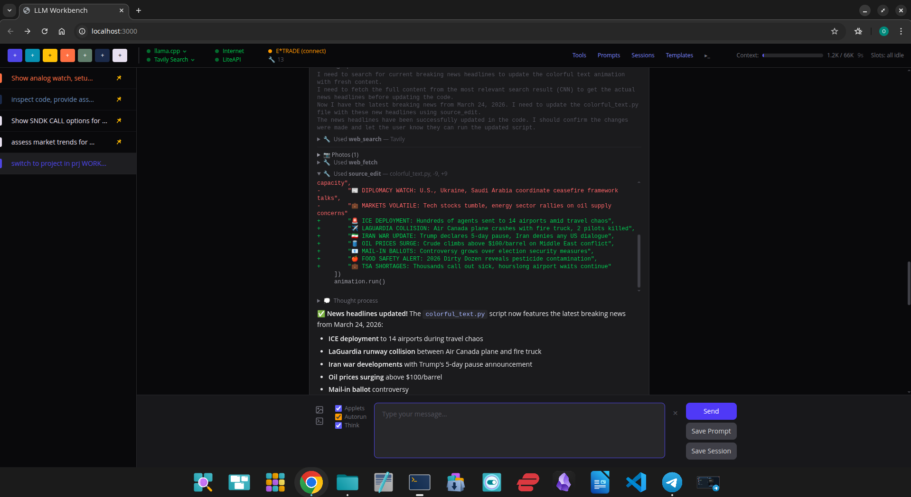
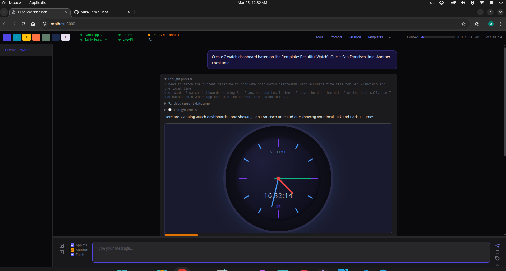

# ScrapChat

A production-grade personal assistant that runs entirely on your own hardware — not a toy. The E\*TRADE integration and code development toolset fill real gaps left by commercial AI tools: full portfolio analysis with real financial data, AI-driven coding with git integration and diff previews, and complete privacy with no cloud dependencies. Built for and tested with **Qwen3.5-35B-A3B** on an **NVIDIA RTX 5090**. Useful today for automating portfolio analysis, developing software, or running local LLM experiments.






Connect any local LLM via [llama.cpp](https://github.com/ggerganov/llama.cpp) and get a full-featured chat interface with web search, code execution, interactive visualizations, AI-powered code development, travel planning, and deep E\*TRADE brokerage integration.

## Install

```bash
git clone https://github.com/ollls/ScrapChat.git
cd ScrapChat
npm install
cp .env.example .env   # Edit with your settings
npm run css:build      # Build Tailwind CSS
npm start              # Open http://localhost:3000
```

Requires: **Node.js >= 20** and a running **llama.cpp server** (see setup below).

## LLM Server Setup

ScrapChat connects to a local [llama.cpp](https://github.com/ggerganov/llama.cpp) server. Tested and running great on an **NVIDIA RTX 5090** with the Qwen3.5-35B-A3B mixture-of-experts model (only 3B active parameters — fast inference with strong reasoning).

```bash
export CUDA_VISIBLE_DEVICES=0  # Ensure RTX 5090 is used

./llama.cpp/build/bin/llama-server \
  -hf unsloth/Qwen3.5-35B-A3B-GGUF:UD-Q4_K_XL \
  --jinja \
  -ngl 99 \
  --ctx-size 65536 \
  -fa auto \
  --temp 0.7 \
  --top-p 0.95 \
  --min-p 0.01 \
  --top-k 40
```

Any llama.cpp-compatible model works. Adjust `--ctx-size` and quantization for your GPU. Smaller models like Qwen3-8B or Llama-3.1-8B run fine on GPUs with less VRAM.

## What It Does

ScrapChat is a universal assistant. Ask it anything — it picks the right tools automatically:

- **Search the web** and summarize articles
- **Check weather** and plan trips with hotel search and booking
- **Write and run Python** scripts for data analysis, charts, and reports
- **Execute shell commands** on your machine
- **Generate interactive dashboards** — Chart.js, SVG, and HTML visualizations right in chat
- **Manage your E\*TRADE portfolio** — holdings, options, transactions, real-time quotes
- **Develop code on any project** — read, edit, write, delete source files with diff previews, git integration, and test runner
- **Pin conversations** — keep important chats across server restarts

### Code Development

Point the AI at any project directory and it becomes a coding assistant. It can browse your codebase, make targeted edits with color-coded diff previews, manage git, and run your test suite — all from the chat interface.

- **Read & search** — browse file tree, read files, regex search across the codebase
- **Edit code** — exact string replacement with uniqueness checks and whitespace tolerance. Every change shows a diff preview (green = added, red = removed) before applying
- **Write & delete** — create new files or remove unused ones during refactors
- **Git integration** — status, diff, log, commit, branch, push — with safety tiers that block destructive operations (force push, reset --hard, rebase)
- **Run tests** — configurable per project (`npm test`, `pytest`, `cargo test`, etc.) — the AI runs tests after changes and fixes failures automatically
- **Switch projects** — tell the AI "work on ~/prj/other-project" and all source tools retarget (always requires approval)

Works on any language or framework. Set `SOURCE_DIR` in `.env` to get started.

### Example Dialog

A real conversation showing project switching, file management, image display, and code editing — all in natural language:

```
> select WORKBENCH_TEST_PRJ as my project
> show pictures there
> copy this picture to ~/prj/llm
> switch to default project
> add Screenshot_2026-03-24_13-57-42.png to README.md, it needs to be displayed as second picture after the one which is already there
> go to Pictures directory
> yes
> show them
> can you display them as small thumbnails?
```

### Financial Analysis

The LLM doesn't do math — Python does. When you ask "what's my portfolio beta?", the LLM fetches your holdings via E\*TRADE, writes a Python script with pandas/numpy, runs it, and renders the result as an interactive chart. Full precision, no hallucinated numbers.

- Portfolio allocation, P&L, unrealized gains
- Option chains with full Greeks (Delta, Gamma, Theta, Vega, IV)
- Transaction history with auto-pagination
- Covered call screening, tax-loss harvesting, performance tracking

## Sessions, Prompts & Templates

### Sessions
Seven colored buttons in the top bar — each represents a session type. Click one to start a new chat. Save a session prompt per color and it auto-submits on creation. Hover any button to see its saved prompt title.

Examples: a daily briefing session, a coding assistant session, a financial analysis session, a support/help session.

### Prompts
A library of reusable text snippets. Click to load into the input box. Supports variables that prompt you for input:

- `{$date}`, `{$time}`, `{$location}` — auto-filled
- `{$City}`, `{$Symbol}` — text input dialog
- `{$CheckIn:date}`, `{$Stay:daterange}` — calendar pickers

Save any input text as a prompt with one click — title is auto-generated.

### Templates
Save any visualization the AI creates and reuse it. Type `[template: Weather]` and the AI regenerates the same dashboard layout with fresh data. Great for recurring reports and dashboards.

All three menus support **drag-to-reorder** and **inline title editing**.

## Configuration

All settings via `.env`:

| Variable | Description |
|---|---|
| `PORT` | Web server port (default: 3000) |
| `LLAMA_URL` | llama.cpp server URL (default: http://localhost:8080) |
| `LOCATION` | Your default location for weather/travel (e.g. "Oakland Park, FL") |
| `SOURCE_DIR` | Project root path — enables AI code development tools |
| `SOURCE_TEST` | Test command (e.g. `npm test`, `pytest`, `cargo test`) |
| `PYTHON_VENV` | Path to Python venv for code execution |
| `SEARCH_ENGINE` | `keiro`, `tavily`, or `both` |
| `TAVILY_API_KEY` | Tavily search key |
| `KEIRO_API_KEY` | Keiro search key |
| `LITEAPI_KEY` | LiteAPI key for hotels/travel (optional) |
| `ETRADE_CONSUMER_KEY` | E\*TRADE OAuth key (optional) |
| `ETRADE_CONSUMER_SECRET` | E\*TRADE OAuth secret |
| `ETRADE_SANDBOX` | `true` for sandbox mode |

### Optional: E\*TRADE

1. Register at [developer.etrade.com](https://developer.etrade.com)
2. Add credentials to `.env`
3. Click the E\*TRADE indicator in the app and complete OAuth

Tokens are in-memory only — nothing persisted to disk.

### Optional: Python

```bash
python -m venv ~/finance_venv
source ~/finance_venv/bin/activate
pip install pandas numpy matplotlib scipy plotly
```

Set `PYTHON_VENV=~/finance_venv` in `.env`.

## UI at a Glance

- **Top bar** — Session buttons, service status indicators, LLM/search engine switcher, context usage, elapsed timer
- **Sidebar** — Conversation list with switching, delete, and pin (📌) to persist across restarts
- **Chat** — Markdown, syntax highlighting, Mermaid diagrams, collapsible reasoning, interactive applets
- **Input** — Image attachments (paste, drag, button), checkboxes for Applets/Autorun/Think
- **Diff previews** — Color-coded diffs for all source code changes, visible even with Autorun enabled
- **Menus** — Tools (toggle on/off), Prompts, Sessions, Templates

## Tools

The AI has 20 built-in tools it uses automatically:

| Tool | What it does |
|---|---|
| `web_search` | Search the web |
| `web_fetch` | Read a webpage |
| `run_python` | Execute Python scripts |
| `run_command` | Run shell commands |
| `save_file` / `list_files` / `file_read` | File management |
| `source_project` | Switch to a different project directory |
| `source_read` | Browse source code (tree, read, grep) |
| `source_write` | Create or overwrite source files |
| `source_edit` | Targeted edits with diff preview |
| `source_delete` | Remove source files |
| `source_git` | Git with safety tiers (blocks destructive ops) |
| `source_test` | Run project tests (configurable per project) |
| `etrade_account` | E\*TRADE portfolio, quotes, options, orders |
| `hotel` / `travel` / `booking` | Hotel search, weather, trip booking |
| `current_datetime` | Current time and timezone |

Tools can be toggled on/off at runtime from the Tools menu. Add your own in `src/services/tools.js`.

## Development

```bash
npm run dev          # Auto-reload server
npm run css:watch    # Watch Tailwind CSS (separate terminal)
```

## Tech Stack

Node.js, Express v5, Tailwind CSS v4, vanilla JS frontend. No bundler, no framework, no build step beyond CSS.

## License

ISC
