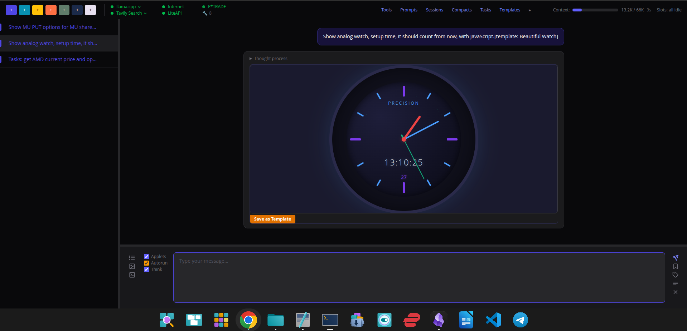

# lumispec.ai

> A local-first AI workbench. Chat with your own LLM, point it at your codebase, your portfolio, the web, your travel plans — and let it do the work end to end.



Connect any [llama.cpp](https://github.com/ggerganov/llama.cpp)-compatible model and get a full chat UI with web search, Python execution, code editing, interactive visualizations, deep E\*TRADE integration, and a task-pipeline runner — all running on your hardware. No cloud dependencies, no telemetry, no per-token bill.

---

## ✨ v1.0.0 highlights

- 🛠️ **Self-aware code tools** — point the assistant at any project (`SOURCE_DIR`) and it can read, edit, write, delete, run tests, and use git on it. Every change shows a color-coded diff preview before applying. Git pushes always require approval; destructive ops (`reset --hard`, `push --force`, `clean -f`, `rebase`) are blocked.
- 🌐 **Three search engines, three fetch modes** — Tavily, Keiro, and DuckDuckGo run in parallel and merge by URL. Stealth (default, `got-scraping`) and full Puppeteer browser modes handle anti-bot pages.
- 📊 **E\*TRADE brokerage** — accounts, options chains with full Greeks, transactions, real-time quotes, gain/loss with cost basis. The LLM never does math itself — Python does.
- 🧮 **Precision mode** — auto-enabled for finance work; forces `run_python` for every calculation, blocks `iterrows()`/row loops, and refuses fabricated numbers.
- 🧩 **Plugin architecture** — 7 hot-loadable plugin groups (core, web, execution, source, travel, finance, wiki) with declarative dependencies. Toggle them at runtime from the Plugins panel.
- 🎯 **TaskMaster + Task Pipeline** — decompose any prompt into a bullet list, then run each step with bounded context (32K-char prior-result cap). Indented bullets are sibling-isolated; flat bullets chain. See [`docs/TASKMASTER.md`](docs/TASKMASTER.md).
- 🎨 **Inline applets** — the assistant emits SVG, Chart.js, and HTML visualizations that render right in the chat bubble (sandboxed iframes).
- 📚 **Two-tier wiki RAG** — your `docs/` are summarized into `wiki/` for fast grep-first retrieval. Karpathy-style self-improving knowledge base.
- 📌 **Pinned conversations** — survive server restarts; long sessions can be LLM-compacted into a structured summary.
- 🔒 **100% local** — your data never leaves the machine. Optional Claude API backend if you want it.

Full release notes: [`releases/1.0.0.md`](releases/1.0.0.md)

---

## 🚀 Quick start

```bash
# 1. Clone and install
git clone git@github.com:ollls/lumispec.ai.git
cd lumispec.ai
npm install
npm run css:build              # build Tailwind once

# 2. Configure
cp .env.example .env           # then edit — see "Configuration" below

# 3. Start your LLM server (separate terminal)
./llama.cpp/build/bin/llama-server \
  -hf unsloth/Qwen3.5-35B-A3B-GGUF:UD-Q4_K_XL \
  -ngl 99 -c 131072 -fa on \
  --host 0.0.0.0 --port 8080

# 4. Run the workbench
npm start                      # → http://localhost:3000
```

**Requirements:** Node.js 20+, a running llama.cpp server (or set `LLM_BACKEND=claude` and supply a key), and an NVIDIA GPU if you want fast local inference. Tested on RTX 5090 with Qwen3.5-35B-A3B (MoE, 3B active params).

Smaller GPUs work — try `unsloth/Qwen3-8B-GGUF:Q6_K` or `unsloth/Llama-3.1-8B-Instruct-GGUF:Q5_K_M` and lower `-c` to fit your VRAM.

---

## 🎬 First steps in the UI

1. **Pick a session** — click one of the colored `+` buttons in the top bar. Each color is a session type; you can save a per-color "session prompt" that auto-submits on every new chat of that color (e.g. *"You are my daily briefing assistant"*).
2. **Type or paste** a question. The assistant routes to the right tools automatically.
3. **Try a multi-step task** — click the bullet-list icon, type a few lines starting with `-`, hit `Ctrl+Enter`. Indent with `Tab` to make sibling-isolated subtasks.
4. **Try Taskmaster** — check the **Taskmaster** box, type a complex prompt normally, and the LLM rewrites it as a bullet list before running.
5. **Try an applet** — ask for *"a Chart.js bar chart of [some data]"* and it'll render inline.
6. **Pin important chats** — the 📌 button on a conversation persists it across restarts.

---

## ⚙️ Configuration

All settings go in `.env`. Only the LLM URL is required — everything else is optional and unlocks more features.

### Minimum

```bash
LLAMA_URL=http://localhost:8080
PORT=3000
```

### Add code-development tools

```bash
SOURCE_DIR=/path/to/your/project
SOURCE_TEST=npm test           # or pytest, cargo test, go test ./..., etc.
PYTHON_VENV=~/finance_venv     # for run_python (any venv with pandas works)
LOCATION=New York, NY          # default location for {$location}, weather, travel
```

### Add web search

Pick at least one of these in your `.env`:

```bash
KEIRO_API_KEY=keiro-...        # https://keirolabs.cloud
TAVILY_API_KEY=tvly-...        # https://tavily.com
```

DuckDuckGo needs no key but requires `stealth` or `browser` fetch mode.

### Add E\*TRADE (optional)

1. Register at [developer.etrade.com](https://developer.etrade.com)
2. Put credentials in `.env`:
   ```bash
   ETRADE_CONSUMER_KEY=...
   ETRADE_CONSUMER_SECRET=...
   ETRADE_SANDBOX=true        # use sandbox first
   ```
3. Click the E\*TRADE indicator in the app and complete OAuth. Tokens stay in memory only — never written to disk.

### Add hotels/travel (optional)

```bash
LITEAPI_KEY=sand_...           # https://www.liteapi.travel
```

The full annotated `.env.example` covers Claude backend, terminal launcher, search base URLs, and more.

---

## 📚 Documentation

The README is a launchpad. Detailed docs live under [`docs/`](docs/) and are mirrored into a compressed grep-friendly index under `wiki/` (local-only, generated via `wiki_index`).

| Doc | What it covers |
|---|---|
| [`docs/TASKMASTER.md`](docs/TASKMASTER.md) | TaskMaster decomposer vs. the Task Pipeline executor — accurate, code-grounded reference |
| [`docs/WEB_RESEARCH.md`](docs/WEB_RESEARCH.md) | Search engines, fetch modes, content extraction pipeline |
| [`docs/WIKI_KNOWLEDGE.md`](docs/WIKI_KNOWLEDGE.md) | Two-tier wiki RAG, build workflow, trust & verification rules |
| [`docs/PLUGIN.md`](docs/PLUGIN.md) | Plugin interface and how to add a new tool group |
| [`docs/HELP.md`](docs/HELP.md) | User-facing help in plain language |
| [`docs/FEATURES.md`](docs/FEATURES.md) | Full feature list |
| [`docs/AUTO_DEPENDECY_FOR_PLUGINS.md`](docs/AUTO_DEPENDECY_FOR_PLUGINS.md) | Cross-plugin dependency cascade design |
| [`docs/TOOL_MODULARIZATION.md`](docs/TOOL_MODULARIZATION.md) | History of the prompt-modularization refactor |
| [`releases/1.0.0.md`](releases/1.0.0.md) | v1.0.0 release notes |

---

## 🧑‍💻 Development

```bash
npm run dev          # auto-reload server (--watch)
npm run css:watch    # rebuild Tailwind on change (separate terminal)
```

**Tech stack:** Node.js, Express 5, Tailwind CSS 4, vanilla JS frontend. No bundler, no framework, no build step beyond CSS. ES modules throughout.

---

## 🛡️ Safety defaults

- **Confirmation required** for `run_python`, `run_command`, and any source-tool write (override with the **Autorun** checkbox per session)
- **Always confirm** for `git push`, `git pull`, `git fetch`, and `source_project` switching — even with Autorun on
- **Always blocked**: `git reset --hard`, `git push --force`, `git clean -f`, `git rebase`
- **Sandboxed iframes** for all applets (`sandbox="allow-scripts allow-same-origin"`)
- **Fabrication detector** built into the finance plugin — refuses to present option Greeks or strike data without first calling the real E\*TRADE chain endpoint

---

## License

ISC
