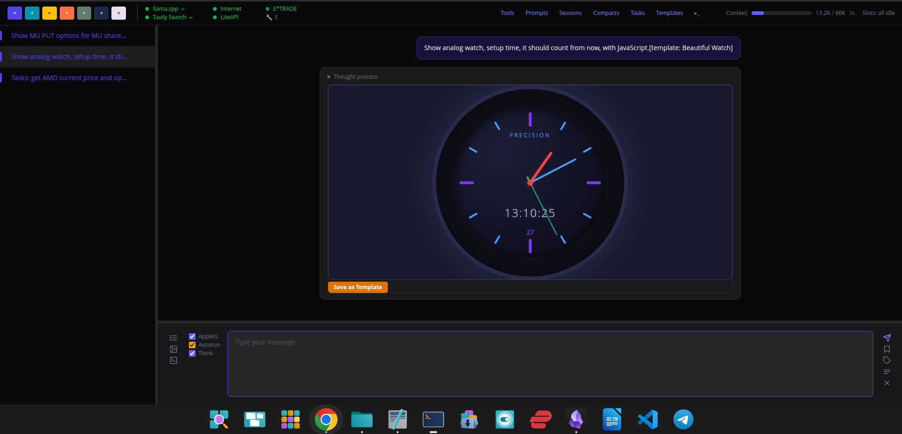

# lumispec.ai

> A local-first AI workbench. Chat with your own LLM, point it at your codebase, your portfolio, the web, your travel plans — and let it do the work end to end.



Connect any [llama.cpp](https://github.com/ggerganov/llama.cpp)-compatible model and get a full chat UI with web search, Python execution, code editing, interactive visualizations, deep E\*TRADE integration, and a task-pipeline runner — all running on your hardware. No cloud dependencies, no telemetry, no per-token bill.

---

## ✨ v1.1.0 highlights

- 📝 **Cite mode** *(new)* — code-citation discipline that guards against documentation hallucination. When on (default), architectural claims in `.md` writes and wiki entries require `(file:line)` citations: the diff preview soft-warns on uncited claims, and `wiki_index` hard-refuses entries whose citations don't resolve on disk. See [`docs/KNOWLEDGE_HARDENING.md`](docs/KNOWLEDGE_HARDENING.md).
- 🛠️ **Self-aware code tools** — point the assistant at any project (`SOURCE_DIR`) and it can read, edit, write, delete, run tests, and use git on it. Every change shows a color-coded diff preview before applying. Git pushes always require approval; destructive ops (`reset --hard`, `push --force`, `clean -f`, `rebase`) are blocked.
- 🌐 **Three search engines, three fetch modes** — Tavily, Keiro, and DuckDuckGo run in parallel and merge by URL. Stealth (default, `got-scraping`) and full Puppeteer browser modes handle anti-bot pages.
- 📊 **E\*TRADE brokerage** — accounts, options chains with full Greeks, transactions, real-time quotes, gain/loss with cost basis. The LLM never does math itself — Python does.
- 🧮 **Precision mode** — auto-enabled for finance work; forces `run_python` for every calculation, blocks `iterrows()`/row loops, and refuses fabricated numbers.
- 🧩 **Plugin architecture** — 7 hot-loadable plugin groups (core, web, execution, source, travel, finance, wiki) with declarative dependencies. Toggle them at runtime from the Plugins panel.
- 🎯 **TaskMaster + Task Pipeline** — decompose any prompt into a bullet list, then run each step with bounded context (32K-char prior-result cap). Indented bullets are sibling-isolated; flat bullets chain. See [`docs/TASKMASTER.md`](docs/TASKMASTER.md).
- 🎨 **Inline applets** — the assistant emits SVG, Chart.js, and HTML visualizations that render right in the chat bubble (sandboxed iframes).
- 📚 **Two-tier wiki RAG** — your `docs/` are summarized into `wiki/` for fast grep-first retrieval. Karpathy-style self-improving knowledge base.
- 📌 **Pinned conversations** — survive server restarts; long sessions can be LLM-compacted into a structured summary.
- 🔒 **100% local** — your data never leaves the machine. Optional Claude API backend if you want it.

Full release notes: [`releases/1.1.0.md`](releases/1.1.0.md) (latest) · [`releases/1.0.0.md`](releases/1.0.0.md)

---

## 🚀 Quick start

```bash
# 1. Clone and install
git clone git@github.com:ollls/lumispec.ai.git
cd lumispec.ai
npm install
npm run css:build              # build Tailwind once

# 2. Configure
cp .env.example .env           # then edit — see "Configuration" below

# 3. Start your LLM server (separate terminal — see "Choosing & running your model")
./llama.cpp/build/bin/llama-server \
  -hf unsloth/Qwen3.8-27B-GGUF:Q6_K_XL \
  --n-gpu-layers 99 --ctx-size 64000 --flash-attn on --jinja \
  --cache-type-k q8_0 --cache-type-v q8_0 \
  --spec-default --spec-type draft-mtp \
  --port 8080

# 4. Run the workbench
npm start                      # → http://localhost:3000
```

**Requirements:** Node.js 20+, a running llama.cpp server (or set `LLM_BACKEND=claude` and supply a key), and an NVIDIA GPU if you want fast local inference. Tested daily on an RTX 5090 with Qwen3.8-27B (dense, `Q6_K_XL`) at a 64K per-slot window.

Smaller GPUs work too — drop to an 8B model and a smaller `--ctx-size`; see the next section for the full launch scripts and what each flag buys you.

---

## 🧠 Choosing & running your model

Any llama.cpp-compatible GGUF works. The two launch scripts below are the ones actually used to develop this app on an RTX 5090 (32 GB); copy either into a file, `chmod +x`, and run it in a separate terminal before `npm start`. The server defaults to `http://localhost:8080`, matching the default `LLAMA_URL`.

### ✅ Qwen3.8-27B (recommended — this is what we run)

Qwen is the recommended backend — it's the most reliable with this app's prompt-based tool-calling
protocol and reasoning (`reasoning_content`) handling. This exact configuration is the one proven
stable over long multi-step tool flows on an RTX 5090; see the note below before adding flags to it.

```bash
#!/bin/bash
# Qwen3.8-27B on an RTX 5090
export CUDA_VISIBLE_DEVICES=0            # pin the RTX 5090

./llama.cpp/build/bin/llama-server \
  -hf unsloth/Qwen3.8-27B-GGUF:Q6_K_XL \
  --n-gpu-layers 99 \
  --ctx-size 64000 \
  --flash-attn on \
  --cache-type-k q8_0 \
  --cache-type-v q8_0 \
  --spec-default \
  --spec-type draft-mtp \
  --temp 1.0 \
  --top-p 0.95 \
  --top-k 20 \
  --min-p 0.0 \
  --jinja \
  --port 8080
```

Why these flags matter for this app:

| Flag | Why |
|---|---|
| `--ctx-size 64000` | The whole context budget derives from this. In current llama.cpp builds it is the **per-slot** window, not a total to be divided — verified by feeding one slot a 56,001-token prompt untruncated. The tool loops read the live slot's `n_ctx` and start winding down at 80% (~51K tokens), trimming old tool results. Raise it and the budget follows — no code change, no `.env` edit. |
| `--cache-type-k q8_0` / `--cache-type-v q8_0` | Quantized KV cache — what makes a 64K window per slot fit alongside a Q6 27B. Requires `--flash-attn on`, so keep that explicit rather than relying on `auto`. |
| `--spec-default` + `--spec-type draft-mtp` | Multi-token-prediction speculative decoding. Long tool loops are the dominant workload here, and the speedup is most visible on them. |
| `--jinja` | Applies the model's own embedded chat template. Non-negotiable — see the warning below. |

Sampling values are Qwen's own recommendations (`temp 1.0`, `top-p 0.95`, `top-k 20`, `min-p 0.0`).

> ⚠️ **On adding flags to this.** A tuned variant of the above — `UD-Q6_K_XL`, `--ctx-size 65536`,
> `-np 1`, `--spec-draft-n-max 3`, `--cache-reuse 256` — produced an `NVRM: Xid 8` GPU channel hang
> under a tool-heavy session (2026-08-29 10:31, RC watchdog, llama-server killed, no reboot needed).
> One fault is not a controlled experiment, and `CRASH.md` records an earlier `Xid 79` on a
> different config, so the card's stability under sustained inference load is its own open question.
> The point stands regardless: **the block above is the one with hours of long multi-step flows
> behind it.** Change one flag at a time and watch `journalctl -k | grep Xid`.

**Note on slot count.** This runs llama-server's default slot count (4 here), and each slot gets its
own full `--ctx-size`, so VRAM cost scales with slot count while the usable window per conversation
does not change. At 64K × 4 the card sits around 30.8 GB of 32 GB. Drop to `-np 1` if you want that
headroom back; it does not shrink any single conversation's window.

### 🔹 Gemma (alternative)

You can run Gemma instead. It works, but Qwen is preferred for tool-heavy workflows — Gemma is noticeably less consistent at emitting well-formed `<tool_call>` blocks over long multi-round runs.

```bash
#!/bin/bash
export CUDA_VISIBLE_DEVICES=0            # pin the RTX 5090

./llama.cpp/build/bin/llama-server \
  -hf unsloth/gemma-4-26B-A4B-it-GGUF:UD-Q8_K_XL \
  --jinja \
  -ngl 99 \
  --parallel 1 \
  --ctx-size 60000 \
  --flash-attn on \
  --temp 1.0 \
  --top-p 0.95 \
  --top-k 64 \
  --host 0.0.0.0 \
  --port 8080
```

> ⚠️ **Always pass `--jinja`.** It applies the model's own embedded chat template. Do **not** substitute `--chat-template gemma` — that forces llama.cpp's legacy built-in template, which mismatches newer Gemma models and causes leaked control tokens (e.g. stray `<|channel|>`/`thought` fragments) and occasional language flips in the output. If you add quantized KV cache (`--cache-type-v q8_0`) to any of these, `--flash-attn on` is required.

Lower `--ctx-size` if you run out of VRAM — the app adapts automatically, since the context budget is read from the live slot rather than hardcoded. Smaller GPUs can drop to `unsloth/Qwen3-8B-GGUF:Q6_K` at a 24–32K window.

---

## 🎬 First steps in the UI

1. **Pick a session** — click one of the colored `+` buttons in the top bar. Each color is a session type; you can save a per-color "session prompt" that auto-submits on every new chat of that color (e.g. *"You are my daily briefing assistant"*).
2. **Type or paste** a question. The assistant routes to the right tools automatically.
3. **Try a multi-step task** — click the bullet-list icon, type a few lines starting with `-`, hit `Ctrl+Enter`. Indent with `Tab` to make sibling-isolated subtasks.
4. **Try Taskmaster** — check the **Taskmaster** box, type a complex prompt normally, and the LLM rewrites it as a bullet list before running.
5. **Try an applet** — ask for *"a Chart.js bar chart of [some data]"* and it'll render inline.
6. **Pin important chats** — the 📌 button on a conversation persists it across restarts.

---

## ⚙️ Configuration

All settings go in `.env`. Only the LLM URL is required — everything else is optional and unlocks more features.

### Minimum

```bash
LLAMA_URL=http://localhost:8080
PORT=3000
```

### Add code-development tools

```bash
SOURCE_DIR=/path/to/your/project
SOURCE_TEST=npm test           # or pytest, cargo test, go test ./..., etc.
PYTHON_VENV=~/finance_venv     # for run_python (any venv with pandas works)
LOCATION=New York, NY          # default location for {$location}, weather, travel
```

### Add web search

Pick at least one of these in your `.env`:

```bash
KEIRO_API_KEY=keiro-...        # https://keirolabs.cloud
TAVILY_API_KEY=tvly-...        # https://tavily.com
```

DuckDuckGo needs no key but requires `stealth` or `browser` fetch mode.

### Add E\*TRADE (optional)

1. Register at [developer.etrade.com](https://developer.etrade.com)
2. Put credentials in `.env`:
   ```bash
   ETRADE_CONSUMER_KEY=...
   ETRADE_CONSUMER_SECRET=...
   ETRADE_SANDBOX=true        # use sandbox first
   ```
3. Click the E\*TRADE indicator in the app and complete OAuth. Tokens stay in memory only — never written to disk.

### Add hotels/travel (optional)

```bash
LITEAPI_KEY=sand_...           # https://www.liteapi.travel
```

The full annotated `.env.example` covers Claude backend, terminal launcher, search base URLs, and more.

---

## 📚 Documentation

The README is a launchpad. Detailed docs live under [`docs/`](docs/) and are mirrored into a compressed grep-friendly index under `wiki/` (local-only, generated via `wiki_index`).

| Doc | What it covers |
|---|---|
| [`docs/TASKMASTER.md`](docs/TASKMASTER.md) | TaskMaster decomposer vs. the Task Pipeline executor — accurate, code-grounded reference |
| [`docs/WEB_RESEARCH.md`](docs/WEB_RESEARCH.md) | Search engines, fetch modes, content extraction pipeline |
| [`docs/WIKI_KNOWLEDGE.md`](docs/WIKI_KNOWLEDGE.md) | Two-tier wiki RAG, build workflow, trust & verification rules |
| [`docs/PLUGIN.md`](docs/PLUGIN.md) | Plugin interface and how to add a new tool group |
| [`docs/HELP.md`](docs/HELP.md) | User-facing help in plain language |
| [`docs/FEATURES.md`](docs/FEATURES.md) | Full feature list |
| [`docs/AUTO_DEPENDECY_FOR_PLUGINS.md`](docs/AUTO_DEPENDECY_FOR_PLUGINS.md) | Cross-plugin dependency cascade design |
| [`docs/TOOL_MODULARIZATION.md`](docs/TOOL_MODULARIZATION.md) | History of the prompt-modularization refactor |
| [`docs/KNOWLEDGE_HARDENING.md`](docs/KNOWLEDGE_HARDENING.md) | Cite mode design — documentation-hallucination guardrails |
| [`releases/1.1.0.md`](releases/1.1.0.md) | v1.1.0 release notes (latest) |
| [`releases/1.0.0.md`](releases/1.0.0.md) | v1.0.0 release notes |

---

## 🧑‍💻 Development

```bash
npm run dev          # auto-reload server (--watch)
npm run css:watch    # rebuild Tailwind on change (separate terminal)
```

**Tech stack:** Node.js, Express 5, Tailwind CSS 4, vanilla JS frontend. No bundler, no framework, no build step beyond CSS. ES modules throughout.

---

## 🛡️ Safety defaults

- **Confirmation required** for `run_python`, `run_command`, and any source-tool write (override with the **Autorun** checkbox per session)
- **Always confirm** for `git push`, `git pull`, `git fetch`, and `source_project` switching — even with Autorun on
- **Always blocked**: `git reset --hard`, `git push --force`, `git clean -f`, `git rebase`
- **Sandboxed iframes** for all applets (`sandbox="allow-scripts allow-same-origin"`)
- **Fabrication detector** built into the finance plugin — refuses to present option Greeks or strike data without first calling the real E\*TRADE chain endpoint

---

## License

ISC
